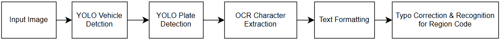
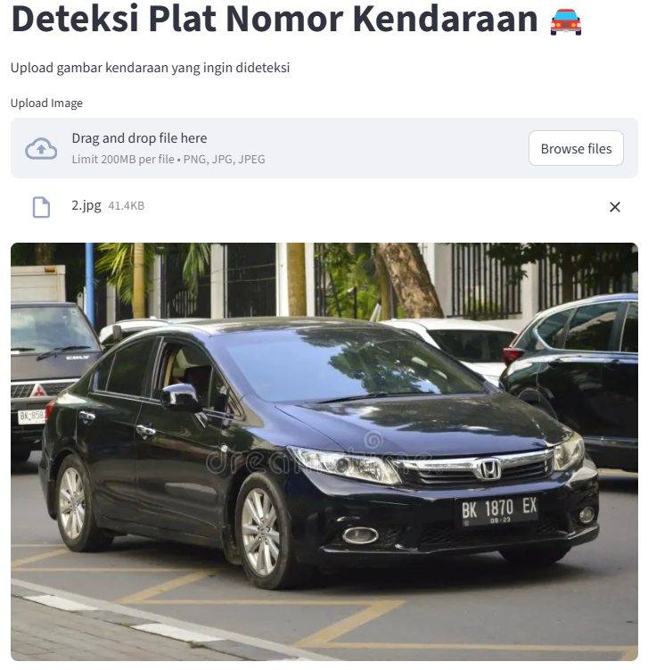
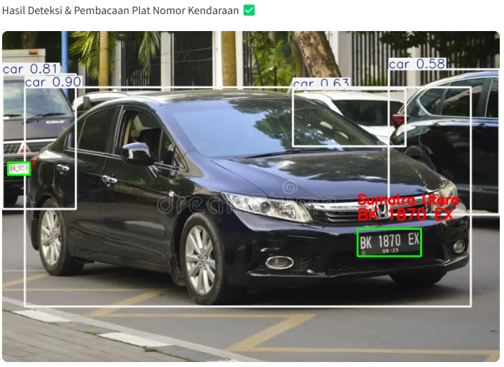

# Automatic License Plate Recognition
Utilizes AI and optical character recognition (OCR) to automatically identify and read vehicle license plates from images

## Key Features
- Detect the location of license plates on cars, buses, trucks, and motorcycles.
- License plate character extraction
- Region code recognition & typo correction (Currently only applicable to regions in Indonesia), using fuzzy matching technique
<p align="center">
  
</p>

## Model

- YOLOv8n for vehicle detection & license plate detection. Dataset can be accessed from here : https://app.roboflow.com/myworkspace-vi5mm/indonesian-plate-number-mpgfj-dm7qu/models

- OCR (easyocr) for character extraction from license plate image

## Preview Results
<p align="center">
  
</p>
<p align="center">
  
</p>

## Project Setup

**1. Clone this repository**

```bash
git clone https://github.com/satyananda03/Automatic-License-Plate-Recognition
```

**2. Create and activate environment**
```bash
python -m venv .venv
source .venv/bin/activate  # Linux/Mac
.venv\Scripts\activate     # Windows
```

**3. Install dependencies**
```bash
pip install -r requirements.txt
```

**4. Run the application**
```bash
streamlit run app.py
```

## Future Improvements

1. Implement Object Tracking for real time streaming purpose

2. Handle more extreme cases, such as dark lighting conditions and plate positions with steep inclines